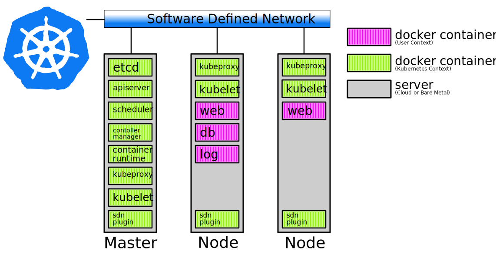
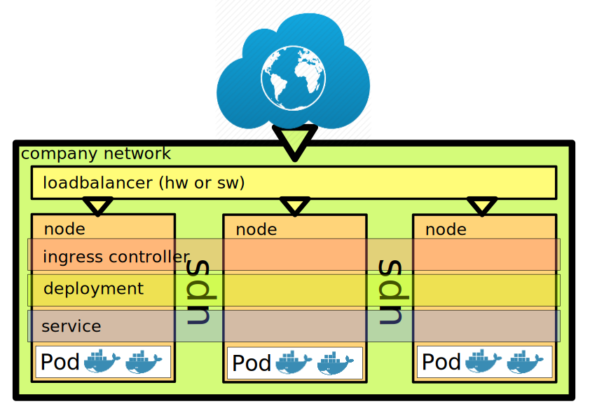

## Before we begin
* Ensure you have a working SSH Client
* Ensure you are logged into our Wifi and can connect to the Internet
* Ensure you have the Digital Ocean SSH key set up

For your convenience:

Add host entries for all 3 Virtual Machines to your computer:
```
master  1.1.1.1
node1   2.2.2.2
node2   3.3.3.3
```
(use the 3 IPs as they are ordered on the strip of paper you were given)

Help: https://goo.gl/315SCi

---

<section data-state="no-title-footer">
## K8S Workshop for Beginners 


## Docker Meetup Bamberg
Bjoern Pohl, Senior Systems Engineer@Paessler

---

## Agenda
* Preparations
* A small introduction to Kubernetes
* Setting up a basic Kubernetes cluster
* Break
* Some basics about Kubernetes
* Running a simple docker container
* Creating a service
* Programming a minimal Flask web application
* Deploying our application to the cluster
* Extending our application
* Bonus: Installing a full-fledged software loadbalancer

---

## What is Kubernetes ?

" An open-source platform designed to automate deploying, scaling, and operating application containers."

---

## Which problems does Kubernetes address?

* Deployment issues (runs on my machine...)
* (Lack of) separation of concerns
* Configuration drifts
* Scaling problems
* ...

Note: Deployment mess, immutability, declarative rollout, self-healing, decoupling, easy scaling, microservice-ready, separation of concerns

---

## What we will cover today 

* Introduction to all of the major components which are somewhat involved in running a Kubernetes cluster
* Installation of a basic multi-node Kubernetes cluster
* Deploying a simple Flask web application on our Kubernetes cluster

---

## What we won't cover today

* Further aspects of High Availability (HA)
* Deep dive into internals of Kubernetes (alternative SDN solutions, security aspects)
* Advanced topics like logging, cloud deployment, monitoring
* Special ingress controllers ( except Traefik :) )

---

## A Brief introduction how a Kubernetes cluster looks like


---

## Installation methods

* Docker4mac only - now comes with Kubernetes built-in (dead easy)
* Minikube (super easy)
* Kubeadm (so-so, we'll see :) )
* From scratch (pita)
* Tons of cloud-enabled solutions, terraform, ansible modules (ymmv)
* Several ready-to-use offers (AKS, EKS, ...) 

https://kubernetes.io/docs/setup/pick-right-solution/

---

## Prepare Docker installation
###### this needs to be done on all of your Droplets

```bash
curl -fsSL https://download.docker.com/linux/ubuntu/gpg | \
    sudo apt-key add -
sudo add-apt-repository \
   "deb [arch=amd64] https://download.docker.com/linux/ubuntu \
   $(lsb_release -cs) \
   stable test"

apt-get update
```
https://goo.gl/YevjDJ

Check if sources are available:
```bash
apt-cache policy|grep docker
 500 https://download.docker.com/linux/ubuntu xenial/test amd64 Packages
     origin download.docker.com
 500 https://download.docker.com/linux/ubuntu xenial/stable amd64 Packages
     origin download.docker.com
```

---

## Install Docker 
###### this needs to be done on all of your Droplets

```bash
apt-get install -y docker-ce=17.03.2~ce-0~ubuntu-xenial
```
https://goo.gl/VpnyyJ

We can't use the latest Docker release as even the most recent Kubernetes version
only supports Docker 17.03.

---

## Check if Docker is running
###### this can be done on all of your Droplets

```bash
docker info
docker ps
```

`docker info` should give you some useful information about Docker's current status

---

## Prepare Kubernetes installation
###### this needs to be done on all of your Droplets

We need yet another APT Repository to get 

```bash
apt-get update && apt-get install -y apt-transport-https

curl -s https://packages.cloud.google.com/apt/doc/apt-key.gpg \
    | apt-key add -

cat <<EOF >/etc/apt/sources.list.d/kubernetes.list
deb http://apt.kubernetes.io/ kubernetes-xenial main
EOF

apt-get update
apt-get install -y kubelet kubeadm kubectl

```
https://goo.gl/fSCgrQ

---

## Check if all nessecary tools are installed
###### this can be to be done on all of your Droplets

```bash
kubeadm version
kubectl version
kubelet --version # note the two dashes, don't forget them!
```

Every command should output its version

---

## Initialize the Kubernetes cluster
###### this **only** needs to be done on your first Droplet, k8s-workshop-x-01

Now, we need to bootstrap our cluster. We'll check the meaning of the cryptic option later...
```bash
kubeadm init --pod-network-cidr=192.168.0.0/16
```
https://goo.gl/7n8RPK

Running this command might take some time and will print a lot of output. 

Please copy the line starting with `kubeadm join --token....` to a local text editor, we'll need it soon, but don't run it yet!

---

###### this **only** needs to be done on your first Droplet, k8s-workshop-x-01
kubeadm init generates a yaml-formatted configuration file; we'll need to point our command line tools to its location
```
export KUBECONFIG=/etc/kubernetes/admin.conf
echo "export KUBECONFIG=$KUBECONFIG" >> ~/.bashrc
```
https://goo.gl/zy89So

---

## Installing a Software Defined Network Plugin
###### this **only** needs to be done on your first Droplet, k8s-workshop-x-01

Kubernetes needs an SDN layer to securely communicate beetween all of its cluster nodes.

So we'll need to install a SDN Plugin of our choice; we have chosen to use Calico:
```
kubectl apply -f \
 https://docs.projectcalico.org/v2.6/getting-started/kubernetes/installation/hosted/kubeadm/1.6/calico.yaml
```
https://goo.gl/ycPfT2

This might take some seconds...
---

## Joining the other nodes
###### this **only** needs to be done on the two remaining Droplets

The other nodes can join the cluster simply by executing the *kubectl join* command we got from our kubeadm init command previously:
```
kubeadm join --token a1f4d9.e056ad31bb9dab03 46.101.183.195:6443 --discovery-token-ca-cert-hash sha256:62ef70345a4467817827cf2a52aeecae68c44475192d6201cb1aad299c802ea1
```
(please don't copy'n'paste, it won't work :))

---

## Checking the cluster status
###### this should be done on the master
You can always check the status of your master and nodes with
```
kubectl get nodes
```
Please give the cluster a minute to get ready. After some seconds, it should look like this:
```
NAME                STATUS    ROLES     AGE       VERSION
k8s-workshop-1-01   Ready     master    5m        v1.9.2
k8s-workshop-1-02   Ready     <none>    1m        v1.9.2
k8s-workshop-1-03   Ready     <none>    1m        v1.9.2
```

---

### Giving the nodes a role
###### this should be done on the master
As seen, the two worker nodes do not yet have a role. Let's fix that and give them a node role.
(actually, this is a bug in kubeadm...)

```bash
kubectl label node ${HOSTNAME%??}02 node-role.kubernetes.io/node=
kubectl label node ${HOSTNAME%??}03 node-role.kubernetes.io/node=

root@k8s-workshop-1-01:~# kubectl get node
NAME                STATUS    ROLES     AGE       VERSION
k8s-workshop-1-01   Ready     master    15m       v1.9.2
k8s-workshop-1-02   Ready     node      11m       v1.9.2
k8s-workshop-1-03   Ready     node      10m       v1.9.2
```
https://goo.gl/Lmw7M3

:)

---

## Install kubectl bash completion

Makes life easier:
```
echo "source <(kubectl completion bash)" >> /etc/bash_completion.d/kubectl
```
https://goo.gl/XRyYqJ

---

## Mission accomplished

Our cluster is now fully operational and is ready to serve some workloads.

Some less important components are still missing, we'll get to them later.


---

Break

---
## Involved Components

---

### Bare Metal or Cloud Servers

Kubernetes still needs Hardware :-)

* Bare Metal(x86,arm,x390)
* Operating System (Linux, Windows)

---

### Container Runtime

* Docker
* rKt

---

### etcD

* K-V database 

---

#### kubectl

* Command Line Interface to Kubernetes

---

#### kubelet

* Node agent running on every node, managing your PodSpec definitions

---

#### kube-proxy

* Handles in- and outgoing network traffic
  * R-R loadbalancing
  * Plugins like DNS
---

#### kube-apiserver

* Servers API Requests

---

#### kube-scheduler

* Manages workload distribution

---
#### kubernetes controller-manager

* Manages controllers
  * replication controller
  * endpoint controller
  * ...

---

#### SDN (Software defined Network, Flannel, Calico,...)

* Routes, encapsulates (and possibly encrypts) your inter-node network traffic

---

#### Web UI

* Graphical User Interface to Kubernetes

(we won't cover that today)

---

#### Terms

* (Worker) Node (formerly Minion): Host in your cluster that runs a workload
* Master: Controls all Nodes, usually doesn't run workloads (but can)

---

#### POD

* POD: Unit formed of several containers. One POD runs on one Node
  * Example: A Web Server container and a database might form a POD.
  * Both will run on the same Node
  * No network separation inside the POD (unlike docker-compose)
    * this is quite a big difference and is important for developers. We'll see later why.

---

### Overview from a network perspective


---

#### Kubernetes Namespaces

* Separation of your Projects, Core Componentes...
```bash
kubectl get daemonSets --namespace=kube-system 
kubectl get all --namespace=kube-system
kubectl get all #wohoo. thats because kube-system usually is masked.
```

---

#### Kubernetes Contexts

* Again, namespaces, but managed and switchable, persistent

persists in $HOME/.kube/config

```bash
kubectl config set-context cool_project --namespace=coolproject
kubectl config set-context cool_project2 --namespace=othernamespace
kubectl config use-context cool_project

```

---

#### Kubernetes Objects
* Everything in Kubernetes is defined as objects
* Every object has an API endpoint
* Object definition can be written in JSON or YAML
  * Use YAML :)

Kubernetes Objects can be applied to the cluster with
```bash
kubectl apply -f some_object.yaml
```
In-Place editing can be done with
```
kubectl <resource> edit -f some_object.yaml
```
Deletion:
```
kubectl <resource> delete -f some_object.yaml
```

---

#### DNS

* Kubernetes runs its own DNS service for all containers, giving them access to individual containers and PODs

---

#### Ingress Controllers
* Manages all your inbound traffic and routes them to your services/PODs/containers
  * Will be defined as an object, but usually triggers a component outside your Kubernetes cluster
    * Traefik
    * Nginx
    * F8 Loadbalancer
    * GCE and other Cloud Solutions

Some LB solutions can also be applied inside the K8S Cluster.

We'll use Traefik as an external Loadbalancer in our Workshop

---

break

---

#### Let's build a simple Flask application

https://goo.gl/Cg6vkf or /root/workshop/simple_flask

---

#### app.py
```python
from flask import Flask
import socket
app = Flask(__name__)

@app.route('/')
def hello_world():
    return '<H1 style="position:fixed; top: 50%; left:50%;transform: translate(-50%, -50%);">Hello from Docker Meetup Bamberg</H1><br>Container Hostname: ' + socket.gethostname()

if __name__ == '__main__':
    app.run(debug=True,host='0.0.0.0', port=80)
```

---

#### Requirements.txt
```
Flask==0.12.2
```
#### Dockerfile
```
FROM alpine
MAINTAINER Bjoern Pohl "bjoern@datenwalze.de"
# flask
RUN apk add --no-cache bash git uwsgi uwsgi-python py2-pip \
	&& pip2 install --upgrade pip \
	&& pip2 install flask

COPY . /app
WORKDIR /app
RUN pip install -r requirements.txt
ENTRYPOINT ["python"]
CMD ["app.py"]
```

---

## Build the application
```
docker build  --tag flaski:latest .
```

Quick test with standard Docker if it's working:
```
docker run -p 8888:80 flaski:latest
```
(open https://your_masters_host_ip:8888) in your browser.

Funny side note: this is how it looks like if you expose port 80 instead of 8888...:
```
root@k8s-workshop-1-01:~/k8s_flask# docker run -p 80:80 flaski:latest
 * Running on http://0.0.0.0:80/ (Press CTRL+C to quit)
 * Restarting with stat
 * Debugger is active!
 * Debugger PIN: 179-267-637
66.249.73.151 - - [20/Jan/2018 15:05:27] "GET /bureau-of-health-information-july-to-september-2017.pdf HTTP/1.1" 404 -
66.249.73.151 - - [20/Jan/2018 15:05:29] "GET /nothing-is-solid-everything-is-energy-scientists.pdf HTTP/1.1" 404 -
66.249.73.151 - - [20/Jan/2018 15:05:31] "GET /driving-times-distances-great-southern-touring-route.pdf HTTP/1.1" 404 -
66.249.73.204 - - [20/Jan/2018 15:05:34] "GET /hidden-story-word-search-variety-puzzles.pdf HTTP/1.1" 404 -
66.249.73.151 - - [20/Jan/2018 15:05:36] "GET /the-best-essential-oils-for-libido-to-love-honor-and.pdf HTTP/1.1" 404 -
66.249.73.204 - - [20/Jan/2018 15:05:38] "GET /marantz-vc5200-dvd-changer-service-manual-download.pdf HTTP/1.1" 404 -
```

---

##  Registry
Kubernetes needs a docker registy to pull the Container. Using a local registry is complicated, as Kubernetes doesn't play well with local (insecure) registries.
So we'll use docker hub.

```
docker login  #login is 'meetupk8sworkshop', password will be given
docker tag flaski:latest meetupk8sworkshop/${HOSTNAME}_miniflask
docker push meetupk8sworkshop/${HOSTNAME}_miniflask
```
https://goo.gl/ic5Aun

${HOSTNAME} contains your Master's Hostname, just to ensure we have unique Image Names (we'll all use the same account and namespace )

---

#### Your first Kubernetes deployment

We'll use a simple imperative command to spin up a deployment in Kubernetes.

```
kubectl run flaski --image=meetupk8sworkshop/${HOSTNAME}_miniflask
kubectl get pods
kubectl describe deployment flaski
kubectl describe pod flaski
kubectl describe pod flaski|grep 'Name:'
```
Kubernetes adds a random string to your deployment name to form the POD name(s).

We can now forward a port to our master by using the POD name (make sure you'll take the name from the grep above):
```
kubectl port-forward flaski-random-letters-and-so 8888:80 & #this wants to stay in the foreground. I won't let it.
curl localhost:8888
kill $! #cleanup your port-forward
```

---

#### Scale your deployment
If you did look closely, Kubernetes deployed this POD to one node. Hey, we've got two!
```
kubectl scale deployment flaski --replicas=2
kubectl describe deployment flaski
```
Ok. Nice. But not really useful - only reachable with a stupid port forward command. Let's clean up this rubbish!
```
kubectl delete deployment flaski
kubectl get pods
kubectl get deployments
```

---

#### Creating a PodObject

Lets put our container definition into an object.
Make sure to replace the image with the image you created recently.
```yaml
#flaski.yaml
apiVersion: v1
kind: Pod
metadata:
  name: flaski
spec:
  containers:
    - image: meetupk8sworkshop/your_masters_hostname_miniflask
      name: flaski-container
      ports:
        - containerPort: 8080
          name: http
          protocol: TCP
```
https://goo.gl/2h1R7T

---

Run it with
```
kubectl apply -f flaski.yaml
```
Let's see...
```
kubectl describe pod flaski
```

---

## Short interlude
We now have a POD consisting of one or more containers running. What about daily tasks the Docker admin is used to?

No problem, it's nearly the same.
```
kubectl logs flaski
 * Running on http://0.0.0.0:80/ (Press CTRL+C to quit)
 * Restarting with stat
 * Debugger is active!
 * Debugger PIN: 191-586-929

kubectl exec flaski -ti /bin/sh
/app #
```
A POD can contain more than one container. If so, and you want one other than the first container, you need to specify the container with `-c`.
---
Again, cleanup please. We can use the same file to wipe everything we generated.
```
kubectl delete -f flaski.yaml
#$ pod "flaski" deleted
```
---
### Labels and annotations
Labels and annotations can be used to tag resources with meta informations.
This is massively used in Kubernetes to identify, select and group resources.

Let's give our flaski POD a label to identify it as a test app:
```
kubectl label pod flaski "app=flaski"
```

Let's check how the object looks now:

```
kubectl get pod flaski -o yaml | ack --passthru 'app:'
```
(ack just highlights the line because it's quite a lot of output)

---

Add a column with our label to a list of PODs
```
kubectl get pod -L app
```
Select PODs based on labels:
```
root@k8s-workshop-1-01:~# kubectl get pods --selector="app=flaski"
NAME      READY     STATUS    RESTARTS   AGE
flaski    1/1       Running   0          57m

root@k8s-workshop-1-01:~# kubectl get pods --selector="apptype=railsi"
No resources found.
```

---

### Replica Sets
Ok, now we've got a POD running, maybe two. But if one dies, it dies. No one will take care of recreating it.
And there's no declarative way of scaling PODs (we only used the imperative way by now.)
So, there's an object called `ReplicaSet` which manages our PODs, takes care of recreation and the correct scaling.

---

Let's create a ReplicaSet using our Docker Image:
```yaml
apiVersion: extensions/v1beta1
kind: ReplicaSet
metadata:
  name: flaskiSet
spec:
  replicas: 2
  template:
    metadata:
      labels:
        app: flaski
        version: "2"
    spec:
      containers:
        - name: flaski
          image: meetupk8sworkshop/k8s-workshop-1-01_miniflask
```
Apply it:
```
kubectl apply -f rs_flaski.yaml
#replicaset "flaskiset" created
```

---

#### Creating a Deployment
So you learned about Replica Sets...

* Deployments look nearly the same as Replica Sets
* Deployments are used to handle rolling updates
* Never use Replica Sets, always use Deployments :)

---

We just need to modify our Replica Set a little bit...
```yaml
#dp_flaski.yaml
apiVersion: extensions/v1beta1
kind: Deployment
metadata:
  name: flaskiset
  labels:
    app: flaski
spec:
  replicas: 2
  selector:
    matchLabels:
      app: flaski
  template:
    metadata:
      labels:
        app: flaski
        version: "2"
    spec:
      containers:
        - name: flaski
          image: meetupk8sworkshop/k8s-workshop-1-01_miniflask
```

---

As always, apply:
```
kubectl apply -f dp_flaski.yaml
```
Let's scale our application:

```
kubectl scale deployment flaskiset --replicas=1
kubectl get deployment flaskiset
kubectl describe deployment flaskiset
kubectl scale deployment flaskiset --replicas=2
```

---

### Services
Ok. We can create a POD now, ensure it's running, etc... - but we are still unable to connect to our service in an appropriate way.
Let's fix that. 

```yaml
kind: Service
apiVersion: v1
metadata:
  name: flaskiservice
spec:
  type: NodePort
  ports:
    - port: 80 # remember our exposed port in out flask app?
      nodePort: 30000 # bad news. Port 80 not possible. 30000+
  selector:
    app: flaski #this actually selects all pods with that label
```
Check:
```
kubectl describe service flaskiservice
kubectl get service flaskiservice
```

---

### A more sophisticated application

* Our application currently only returns a string
* Let's add a database to our application
* Go to `/root/workshop/simple_flask`
* `git checkout redis`

We have added a simple redis-dependent function in our app.
We now need to add the Redis container to our POD and add some environment variables...

---

```
docker build  --tag redisflaski:latest .
docker tag redisflaski:latest meetupk8sworkshop/${HOSTNAME}_redisflask
docker push meetupk8sworkshop/${HOSTNAME}_redisflask
```
---

We need to modify our deployment a bit...
```yaml
apiVersion: extensions/v1beta1
kind: Deployment
metadata:
  name: redisflaskiset
  labels:
    app: flaski
spec:
  replicas: 2
  selector:
    matchLabels:
      app: flaski
  template:
    metadata:
      labels:
        app: flaski
        version: "2"
    spec:
      containers:
        - name: flaski
          image: meetupk8sworkshop/k8s-workshop-1-01_redisflask
          env:
            - name: REDIS_HOST
              value: "localhost"
            - name: REDIS_PORT
              value: "6379"
        - name: redis
          image: redis:3.2-alpine

```
and apply it as usual...

---

### Bonus: Traefik

* A 'real' loadbalancer in front of our cluster
* Allows low port ingress

Live Demo...

---

### Clean it up
```
kubectl delete deployments --all
kubectl delete services --all
kubectl delete ingress --all
```
---

# Thanks!

* @DrSlow

* https://github.com/DevOps-Academy-Org/kubernetes-workshop

